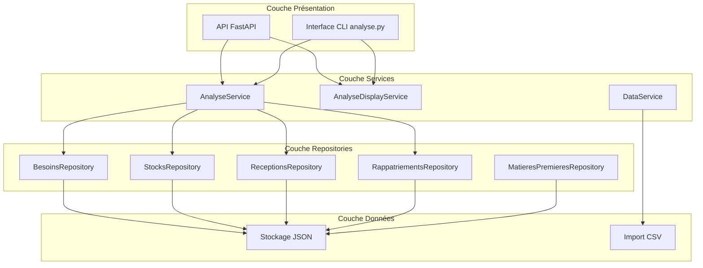
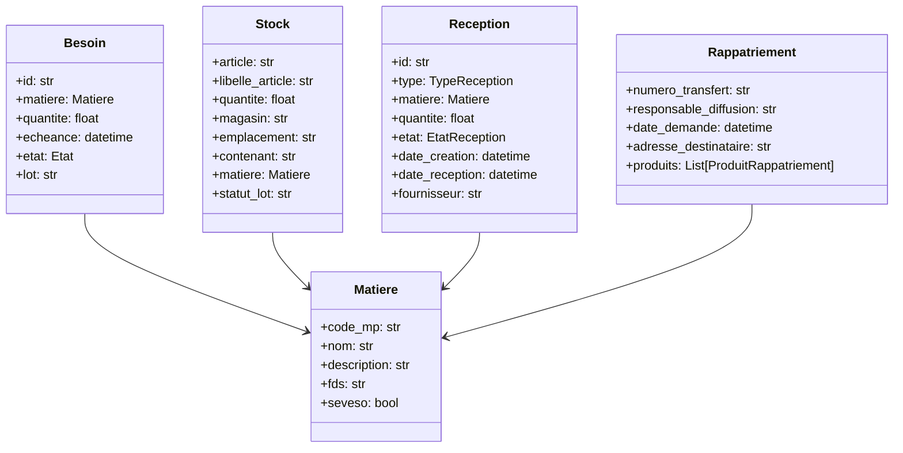
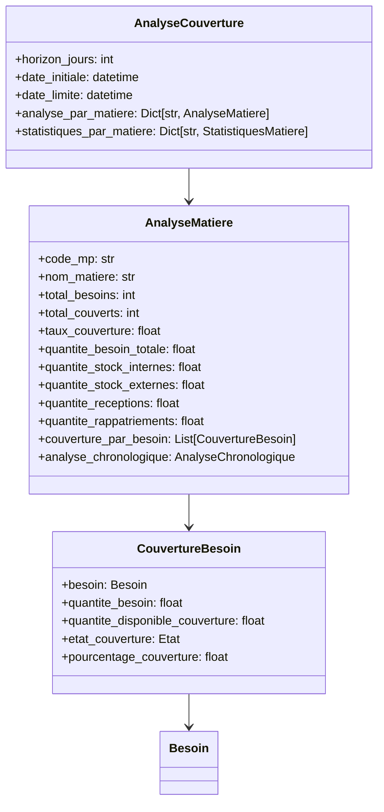
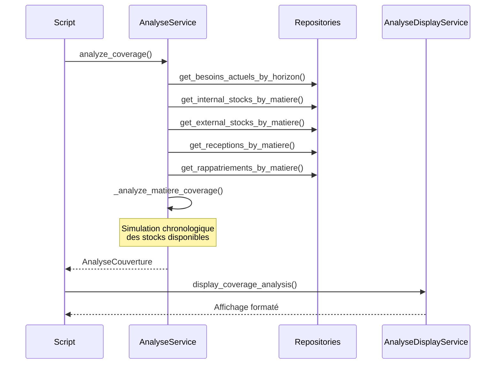
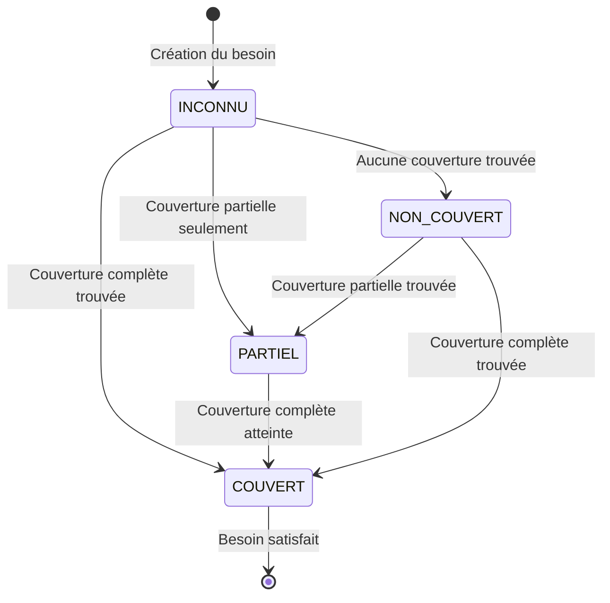
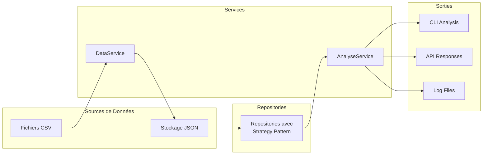

# Interflow Backend

## 📋 Description

Interflow Backend est une application Python conçue pour gérer la couverture des besoins en matières premières dans un contexte industriel. Le système analyse les besoins, vérifie leur couverture par les stocks existants, les réceptions prévues et les rapatriements, et fournit des analyses détaillées de couverture.

## 🏗️ Architecture du Projet

### Structure des Dossiers

```
src/
├── api/                    # API FastAPI
│   ├── main.py            # Configuration principale de l'API
│   ├── server.py          # Serveur API avec configuration
│   ├── analyse.py         # Endpoints d'analyse de couverture
│   ├── besoins.py         # Endpoints de gestion des besoins
│   ├── stocks.py          # Endpoints de gestion des stocks
│   ├── receptions.py      # Endpoints de gestion des réceptions
│   ├── rappatriements.py  # Endpoints de gestion des rapatriements
│   └── matieres.py        # Endpoints de gestion des matières
├── services/               # Services métier
│   ├── analyse_service.py         # Service d'analyse de couverture
│   ├── analyse_display_service.py # Service d'affichage des résultats
│   └── data_service.py            # Service de gestion des données
├── models/                 # Modèles de données Pydantic
│   ├── besoin.py          # Modèle des besoins
│   ├── stock.py           # Modèle des stocks
│   ├── reception.py       # Modèle des réceptions
│   ├── rappatriement.py   # Modèle des rapatriements
│   ├── matieres.py        # Modèle des matières premières
│   └── analyse.py         # Modèles d'analyse de couverture
├── repositories/           # Couche d'accès aux données (Pattern Repository)
│   ├── base_repository.py         # Repository de base générique
│   ├── storage_strategies.py      # Stratégies de stockage (JSON, CSV)
│   ├── besoins_repository.py      # Repository des besoins
│   ├── stocks_repository.py       # Repository des stocks
│   ├── receptions_repository.py   # Repository des réceptions
│   ├── rappatriements_repository.py # Repository des rapatriements
│   └── matieres_premieres_repository.py # Repository des matières
├── scripts/               # Scripts utilitaires
│   └── analyse.py         # Script principal d'analyse de couverture
├── lib/                   # Utilitaires et helpers
│   ├── paths.py           # Gestion des chemins de fichiers
│   └── logging/           # Système de logging
│       └── analyse_logger.py # Logger pour les analyses
└── outputs/               # Sorties générées (logs, rapports)
    └── logs/              # Fichiers de logs d'analyse
```

## 🔄 Architecture Générale



## 📊 Modèles de Données

### Modèles Principaux



### Modèles d'Analyse



## 🔧 Services et Architecture

### Services Principaux

#### 1. AnalyseService
Service principal d'analyse de couverture des besoins :

```python
from services.analyse_service import AnalyseService

# Analyse complète (toutes les matières)
service = AnalyseService(besoins_repo, stocks_repo, receptions_repo, rappatriements_repo)
analyse_complete = service.analyze_coverage(date_initiale, horizon_days)

# Analyse d'une matière spécifique
analyse_matiere = service.analyze_matiere_coverage(code_mp, date_initiale, horizon_days)
```

**Fonctionnalités :**
- Analyse de couverture par matière
- Simulation chronologique de la consommation des stocks
- Prise en compte des réceptions et rapatriements
- Calcul des statistiques de couverture
- Gestion des stocks internes vs externes

#### 2. AnalyseDisplayService
Service d'affichage formaté des résultats :

```python
from services.analyse_display_service import AnalyseDisplayService

# Affichage de l'analyse complète
AnalyseDisplayService.display_coverage_analysis(analyse)

# Transformation pour API
display_service = AnalyseDisplayService()
api_response = display_service.to_api_coverage_format(analyse)
```

**Fonctionnalités :**
- Affichage formaté avec émojis et couleurs pour CLI
- Transformation en format JSON pour API
- Résumé des statistiques globales
- Détail par matière avec quantités disponibles
- Export vers fichiers de logs

#### 3. DataService
Service de gestion des données :

```python
from services.data_service import DataService

data_service = DataService()
# Fonctionnalités de rechargement et gestion des données
```

### Logique d'Analyse de Couverture



## 🚀 Installation et Utilisation

### Prérequis

- Python 3.8+
- FastAPI (pour l'API)
- Pydantic (pour les modèles)
- Uvicorn (serveur ASGI)

### Installation

```bash
# Cloner le projet
git clone <repository-url>
cd interflow-backend

# Créer un environnement virtuel
python -m venv .venv

# Activer l'environnement virtuel
# Windows
.venv\Scripts\activate
# Linux/Mac
source .venv/bin/activate

# Installer les dépendances
pip install -r requirements.txt
```

### Utilisation

#### 🔍 Script d'Analyse de Couverture (CLI)

Le script principal `analyse.py` permet d'analyser la couverture des besoins en matières premières :

```bash
# Analyse complète (toutes les matières)
python -m src.scripts.analyse -d=2025-09-26 --horizon=30

# Analyse d'une matière spécifique
python -m src.scripts.analyse -d=2025-09-26 --horizon=30 --code-mp=E05682

# Utilisation par défaut (aujourd'hui, horizon 5 jours)
python -m src.scripts.analyse
```

**Options disponibles :**
- `-d, --date` : Date initiale au format YYYY-MM-DD (défaut: aujourd'hui)
- `--horizon` : Horizon d'analyse en jours (défaut: 5)
- `--code-mp` : Code de matière première pour filtrer l'analyse

#### 🌐 API REST

##### Lancement du serveur

```bash
# Via le serveur configuré (recommandé)
python src/api/server.py

# Via uvicorn directement
python -m uvicorn api.main:app --reload --host 0.0.0.0 --port 8000

# Via pyproject.toml (si installé en package)
run_api

# Via Docker
docker-compose up
```

Le serveur sera accessible à l'adresse : `http://localhost:5000` (serveur configuré) ou `http://localhost:8000` (uvicorn direct)

##### Documentation API

- **Swagger UI** : `http://localhost:5000/docs`
- **ReDoc** : `http://localhost:5000/redoc`

##### Endpoints principaux

**Analyse de couverture :**
- `GET /analyse` - Analyse complète de la couverture des besoins
- `GET /analyse/coverage/{code_mp}` - Analyse pour une matière spécifique
- `GET /analyse/matieres` - Liste des matières disponibles

**Gestion des données :**
- `GET /besoins` - Liste des besoins
- `GET /stocks` - Liste des stocks
- `GET /receptions` - Liste des réceptions
- `GET /rappatriements` - Liste des rapatriements
- `GET /matieres` - Liste des matières premières

#### Sorties et Logs

Le script génère automatiquement :
- **Affichage console** : Résumé formaté avec émojis et couleurs
- **Fichiers de logs** : Sauvegardés dans `outputs/logs/`
  - `analyse.log` : Analyse complète
  - `analyse_{CODE_MP}.log` : Analyse d'une matière spécifique

**Exemple de sortie :**
```
📊 ANALYSE DE COUVERTURE DES BESOINS
================================================================================

🗓️ Horizon d'analyse: 30 jours
📅 Date initiale: 2025-09-26

📈 STATISTIQUES GLOBALES:
   • Total besoins analysés: 15
   • Total besoins couverts: 8
   • Taux de couverture: 53.3%

🧪 ANALYSE DE LA MATIÈRE:
   📦 Matière: EUCALYPTOL NO (E05682)
      • Besoins: 5 | Couverts: 1
      • Taux couverture: 20.0%
      • Quantité besoin total: 820.0
      • Stock internes: 584.35
      • Stock externes: 8640.0
      • Réceptions prévues: 250.0
      • Rapatriements: 0.0
      • Total disponible: 834.35
```

## 📈 États des Besoins



## 🔄 Flux de Données



## 🛠️ Fonctionnalités Principales

- **Analyse de couverture** : Évaluation de la disponibilité des matières premières
- **Gestion multi-sources** : Stocks, réceptions, rapatriements
- **API REST complète** : Interface FastAPI pour intégration
- **Interface CLI** : Script d'analyse en ligne de commande
- **Modèles typés** : Validation Pydantic
- **Pattern Repository** : Abstraction de la couche données
- **Stratégies de stockage** : Support JSON et CSV
- **Logging avancé** : Traçabilité des analyses
- **Simulation chronologique** : Analyse temporelle des besoins

## 📝 Notes Techniques

- **Architecture modulaire** : Services, repositories, modèles séparés
- **Pattern Strategy** : Stratégies de stockage interchangeables
- **Validation Pydantic** : Types et contraintes strictes
- **FastAPI** : API moderne avec documentation automatique
- **Logging contextualisé** : Logs par analyse et matière
- **Support Docker** : Conteneurisation complète

## 🔮 Évolutions Futures

- Intégration d'une base de données (PostgreSQL)
- Interface utilisateur web React/Vue
- Notifications en temps réel
- Optimisation des algorithmes de couverture
- Règles métier configurables
- Workflows d'approbation
- Intégration avec systèmes ERP
